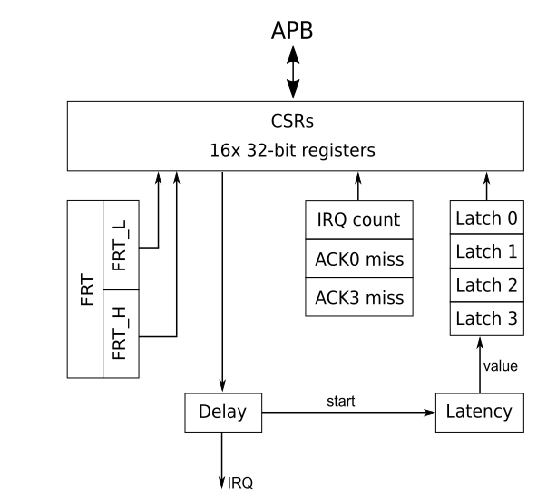

# Interrupt Latency Timer

An APB slave device, capable to generate an interrupt request
signal and to count clock cycles till the request is acknowledged
by an ISR and/or received by an application program

The core is connected to the MSS FIC3 (APB) and mapped to the address
space at base address `0x41000000`. The core clock frequency is
25 MHz, therefore LSB of all timers and counters is equivalent to **40 ns**.

## Register Map

| Offset (hex) | Mode | Register Name                            |
|:------------:|:----:|:-----------------------------------------|
| 00           | RO   | Core ID                                  |
| 04           | RW   | Master Control and Status register       |
| 08           | RO   | Free-running timer latch (low 32 bits)   |
| 0c           | RO   | Free-running timer latch (high 32 bits)  |
| 10           | RW   | Interrupt generator delay                |
| 14           | RW   | reserved                                 |
| 18           | RW   | reserved                                 |
| 1c           | RW   | reserved                                 |
| 20           | RW   | Interrupt Acknowledge/Status register    |
| 24           | RO   | Interrupt counter                        |
| 28           | RO   | Missed ACK 0 counter                     |
| 2c           | RO   | Missed ACK 3 counter                     |
| 30           | RO   | ACK 0 latency latch                      |
| 34           | RO   | ACK 1 latency latch                      |
| 38           | RO   | ACK 2 latency latch                      |
| 3c           | RO   | ACK 3 latency latch                      |

## Registers Description

### Core ID

Identification register contains output of the `'git rev-parse --short=8 HEAD'`
command as an unsigned 32-bit integer.

### Master Control and Status register

| Bits |  Mode |  Description                                    |
|:----:|:-----:|:------------------------------------------------|
| 1..0 |  RW   | Interrupt Request Generator Mode                |
|      |       | 00 -- disabled                                  |
|      |       | 01 -- free-running                              |
|      |       | 10 -- delay after ACK0                          |
|      |       | 11 -- delay after ACK3                          |
| 6..2 |  RW   | reserved                                        |
| 7    |  RW   | Start (write 1 starts delay counter (for the first time), write 0 -- ignored) |
| 23..8 | RW   | reserved                                        |
| 24   |  W    | FRT Latch                                       |
|      |  R    | FRT Latch L Valid                               |
| 25   |  W    | FRT Clear                                       |
|      |  R    | FRT Latch H Valid                               |
| 26   |  RO   | FRT Latch L Overwritten                         |
| 27   |  RO   | FRT Latch H Overwritten                         |
| 30..28 | RW  | reserved                                        |
| 31   |  RW   | Enable                                          |

This register provides bits for global control of the core (enable),
setting interrupt request generator mode and Free-running timer latch
control and status.

Enable (bit 31) -- when this bit is '0' all functional blocks of the
core are disabled, all the registers are set to their initial values
and no write access is possible. The only registers available in this
mode are the Core ID and the Master Control/Status register itself.
Writing '1' to the Enable bit must be the first step to initialize
the core.

Interrupt request generator mode (bits 1..0) -- these bits defines
conditions when the delay counter of the interrupt request generator
is restarted. These conditions are described below in the Interrupt
generator delay register section.

Bits 27..24 provides status and control of the Free-running timer
latch registers and are described in the following section. The
free-running counter is a 64-bit counter that starts automatically
when the Enable bit is set to '1'. Its content is incremented on every
clock cycle and may be used as a monotonic time-stamp with a resolution
of 40 ns for software events.

### Free-running timer latch (low and high) registers

Read only registers that hold latched value of the Free-running
counter.  Writing 1 to bit 24 of the Master Control register transfers
current value of the Free-running Counter to the latch registers and
sets bits 24 and 25 of the status register. If previously latched
value have not been read from the latch registers, then bit(s) 26 and
27 are set to indicate that the respective value has been overwritten,
but new value is stored in the latch registers anyway.

Reading of the latch register clears respective Valid bit, the value
in the latch register itself is not affected and may be read multiple
times. Writing 1 to the bit 25 of the Master Control register clears
all Valid and Overwritten bits, but does not change content of the
latch registers.

### Interrupt generator delay register

Bits [30:0] of this register are copied into an delay counter when it
is started, MSB (bit 31) of the delay counter is always loaded with
'0'.  Then the delay counter is decremented every clock till it is
underflow and its MSB becomes '1'. At this moment interrupt request is
generated and latency counter is started.

A new delay value is loaded into the delay counter and the counter is
re-started on one of the following events, depending on the mode bits
in the Master Control register.

In a free-running mode ('01') the counter is loaded with a value from
the Delay register and starts a new cycle immediately after the
previous period has expired, without waiting for any software
action. In this mode interrupts are generated at a constant rate.

In an ACK0 mode ('10') the counter is loaded with a value from the
Delay register and starts a new cycle when software acknowledges the
interrupt request by writing '1' to bit 0 of the Acknowledge
register. In this mode interrupts are generated after a fixed delay
after the previous is received by the low-level interrupt service
routine.

In an ACK3 mode ('11') the counter is loaded with a value from the
Delay register and starts a new cycle when software acknowledges
processing of the interrupt event by writing '1' to bit 3 of the
Acknowledge register. In this mode interrupts are generated after a
fixed delay after the previous even is processed by an application
software.

### Interrupt Acknowledge and Status register

| Bits |  Mode |  Description                                    |
|:----:|:-----:|:------------------------------------------------|
| 3..0 |  W    | Acknowledge 3..0                                 |
|      |       | Write 1 to store current value of the latency   |
|      |       | counter in the corresponding latch register     |
|      |  R    | Valid 3..0                                      |
|      |       | A value has been stored in the latch register   |
|      |       | and not read yet                                |
| 7..4 |  W    | Clear_latch 3..0                                |
|      |       | Write 1 to clear latch Valid and Overwritten    |
|      |       | status bits                                     |
|      |  R    | Overwritten 3..0                                |
| 8    |  W    | Clear interrupt counter                         |
|      |       | Write 1 to clear total interrupt counter        |
|      |  R    | Delay counter is running                        |
|      |       | Status of the delay counter, an interrupt will  |
|      |       | be generated after the delay counter under flows |
| 9    |  W    | Clear missing ACK0 counter                      |
|      |       | Write 1 to clear missing ACK0 counter           |
|      |  R    | Latency counter is running                      |
|      |       | Status of the latency counter, an interrupt has |
|      |       | been generated, but not yet acknowledged by     |
|      |       | the ACK3 (application software)                 |
| 10   |  WO   | Clear missing ACK3 counter                      |
|      |       | Write 1 to clear missing ACK3 counter           |
| 15..11 | RO  | reserved                                        |
| 16   |  RO   | ACK3 Wait                                       |
|      |       | An interrupt request has been generated but not |
|      |       | acknowledged yet by an application software      |
| 23..17 | RO  | reserved                                        |
| 24   |  RO   | ACK0 Wait                                       |
|      |       | An interrupt request has been generated but not |
|      |       | acknowledged yet by an interrupt service routine |
| 30..25 | RO  | reserved                                        |
| 31   |  WO   | Clear interrupt counters                        |
|      |       | Write 1 to clear all interrupt counters         |
|      |       | (total, missing ACK0, and missing ACK3)         |

Writing '1' into an acknowledge bit (3..0) stores current value of the
latency timer into the corresponding latch register. Acknowledge bits
0 and 3 have additional functionality.

Acknowledge bit 0 is meant to be written by a low-level interrupt
service routine and, in addition to latching latency timer value, it
signals the core to deassert the interrupt request signal.

Acknowledge bit 3 is meant to be written by an application software
when all the actions required to process a hardware event are
completed. In addition to latching latency timer value, it signals the
core that all the processing of the current event is completed and
stops the latency timer.

Acknowledge bits 1 and 2 are implemented to measure latency of an
intermediate steps in handling hardware events (device driver,
scheduler, etc.) and do not have any additional functionality inside
the core besides latching a current value of the latency counter.

### Interrupt counters

Total interrupt counter is a 32-bit counter storing a total number of
generated interrupt requests. The counter is incremented every time a
new interrupt request is generated.

Missing ACK0 and ACK3 counters are 32-bit counters storing a number of
missing acknowledge events. The counters are incremented every time a
new interrupt request is generated if there were no corresponding
acknowledge bit written since the previous request. These counters
indicate that software (either low-level ISR for ACK0 or application
for ACK3) is not capable to handle hardware events in time and is
missing some of them.

These three counters are not protected from an overflow, so, after
the value 0xffffffff they will continue to 0x0.

### Interrupt latency latch registers

Four read-only registers storing the value of the latency counter at
the moment the corresponding acknowledge bit was written into the
Acknowledge register.
